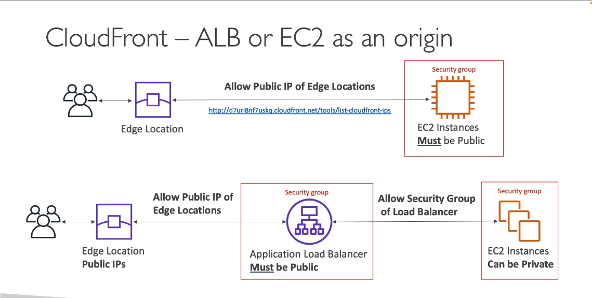

# AWS CloudFront with EC2 Application Load Balancer (ALB)

Setting up **AWS CloudFront** with an **Application Load Balancer (ALB)** as the origin improves the global delivery of dynamic content hosted on EC2 instances. This setup is ideal for applications requiring high availability, load balancing, and secure global access.

---

## Benefits of Using CloudFront with ALB

- **Reduced Latency**: CloudFront caches content at edge locations closer to users, reducing load time.
- **Improved Performance**: Delivers both static and dynamic content efficiently.
- **Enhanced Security**: Protects the backend with CloudFront’s SSL/TLS encryption, AWS WAF, and geo-restriction.
- **Load Balancing**: ALB distributes incoming traffic across multiple EC2 instances in different Availability Zones, ensuring high availability and fault tolerance.

---

## Setting Up CloudFront with ALB

### Step 1: Set Up an Application Load Balancer (ALB)

1. Open the **EC2 Console** and navigate to **Load Balancers**.
2. Click on **Create Load Balancer** and select **Application Load Balancer**.
3. Configure the load balancer:
   - Name your load balancer.
   - Choose **Internet-facing** as the scheme for public access.
   - Select the appropriate **VPC** and **Availability Zones**.
4. Configure the **Listener**:
   - Set the listener to **HTTP** or **HTTPS**.
   - For HTTPS, upload an SSL certificate through **AWS Certificate Manager (ACM)**.
5. Set up **Target Groups**:
   - Create a target group with your EC2 instances.
   - Register EC2 instances in the target group.
6. Review and create the ALB.

### Step 2: Create a CloudFront Distribution

1. Open the **CloudFront Console** and click on **Create Distribution**.
2. Select the **Web** distribution.
3. In the **Origin Settings**:
   - Set **Origin Domain Name** to your ALB’s domain name.
   - Choose **Origin Protocol Policy**: Use HTTPS if your ALB is configured for SSL/TLS.
4. **Viewer Protocol Policy**: Select **Redirect HTTP to HTTPS** to enforce secure connections.
5. **Allowed HTTP Methods**: Choose between `GET, HEAD` (for static content) or `GET, HEAD, OPTIONS, PUT, POST, PATCH, DELETE` if you need full CRUD operations.
6. (Optional) **Cache and Behavior Settings**:
   - Configure caching policies for static and dynamic content based on your application needs.
   - Customize **Cache TTL** (Time to Live) for specific paths or query strings.
7. (Optional) **SSL Certificate**: If using a custom domain, select an ACM certificate for HTTPS.
8. Click **Create Distribution**.

### Step 3: Integrate ALB with CloudFront

To restrict direct access to your ALB (optional but recommended), set up **AWS WAF** or **Security Groups**:

1. **AWS WAF**: Attach an AWS WAF Web ACL to CloudFront to filter incoming requests and secure against threats like SQL injection and XSS.
2. **Security Group**: Configure the ALB’s security group to allow inbound traffic only from CloudFront IP ranges (published in the [AWS IP Address Ranges](https://docs.aws.amazon.com/general/latest/gr/aws-ip-ranges.html)).

### Step 4: Configure DNS with Custom Domain (Optional)

1. Go to **Route 53** or your DNS provider.
2. Create an **A record** or **CNAME** that points to the CloudFront domain name (e.g., `dxxxxxxx.cloudfront.net`) for your custom domain (e.g., `www.example.com`).

---

## Cache Invalidation

To force CloudFront to clear specific cached content:

1. Go to **CloudFront Console**.
2. Select your distribution and navigate to the **Invalidations** tab.
3. Click **Create Invalidation** and specify the paths to clear (e.g., `/index.html`).

---

## Example Access URLs

- **CloudFront URL**: `https://dxxxxxxx.cloudfront.net/your-path`
- **Custom Domain URL**: `https://www.example.com/your-path`

---

## Example Scenarios

- **Web Applications**: CloudFront caches responses from the ALB to reduce latency for users across different regions.
- **APIs**: Protect your backend APIs by delivering them through CloudFront with caching for faster response times.
- **Static and Dynamic Content**: Ideal for applications where static assets (e.g., CSS, JS) and dynamic responses need to be delivered quickly.

---

## Additional Resources

- [AWS CloudFront Documentation](https://docs.aws.amazon.com/cloudfront/)
- [Application Load Balancer Documentation](https://docs.aws.amazon.com/elasticloadbalancing/latest/application/introduction.html)

---

**Note**: CloudFront’s caching may take time to propagate updates. Use cache invalidation for immediate content refresh.

