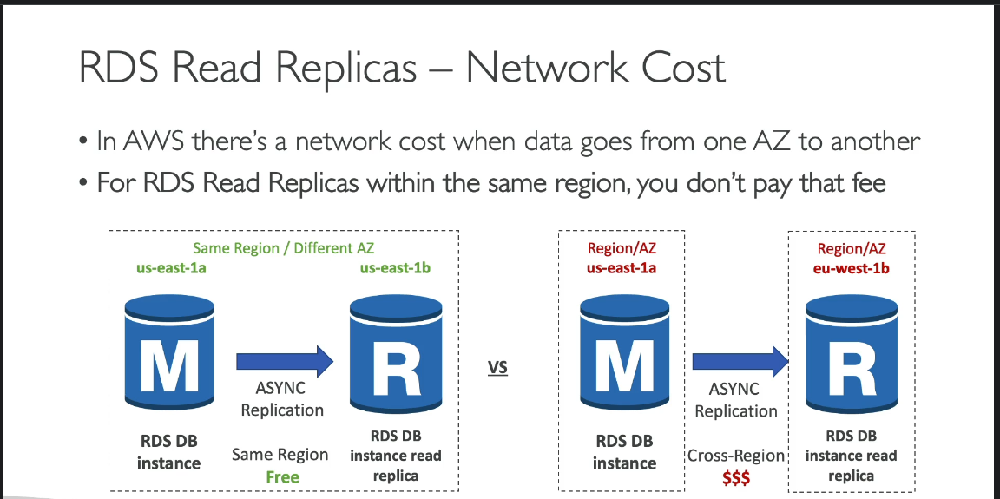

# AWS RDS Multi-AZ vs. Read Replicas

This document explains the key differences between AWS RDS Multi-AZ and Read Replicas, detailing their purposes, use cases, and best practices. Both are essential for managing database availability, fault tolerance, and scalability in AWS environments, but they serve distinct needs.

---

## 1. Overview

- **Multi-AZ Deployment**: Designed for high availability and automatic failover.
- **Read Replicas**: Built for scaling read operations and offloading read-heavy workloads.

---

## 2. Key Differences

| Feature                 | Multi-AZ                              | Read Replicas                          |
|-------------------------|---------------------------------------|----------------------------------------|
| **Primary Goal**        | High Availability, Fault Tolerance   | Read Scalability                       |
| **Data Replication**    | Synchronous                          | Asynchronous                           |
| **Failover**            | Automatic failover to standby        | No automatic failover                  |
| **Read Traffic Support**| Not intended for scaling reads       | Offloads read traffic from primary     |
| **Write Latency**       | Slightly increased                   | No impact on primary instance writes   |
| **Use Case**            | Production environments requiring high availability | Read-heavy applications or analytics  |
| **Pricing**             | Additional instance costs for standby | Pay for each additional replica        |

---

## 3. Multi-AZ Deployment

### Purpose
Multi-AZ deployments are primarily used to enhance **availability** and **fault tolerance**.

### How It Works
- AWS maintains a **synchronous copy** of the primary database instance in another Availability Zone.
- **Automatic Failover**: In the event of a failure (e.g., an AZ outage or instance crash), AWS automatically switches to the standby instance.

### Use Cases
- Ensures high availability and reliability for **production workloads**.
- Suitable for applications needing **automatic failover** without interruptions to end-users.

### Performance Impact
- **Write Operations**: Slight increase in latency due to synchronous replication to the standby.
- **Read Operations**: Not intended for scaling reads; only the primary instance handles read and write traffic.

### Pricing
Multi-AZ deployments incur higher costs as you pay for an additional instance as a standby. However, this setup provides managed failover and fault tolerance.

---

## 4. Read Replicas

### Purpose
Read Replicas are designed for **scaling read traffic** and improving read performance by offloading read-heavy workloads.

### How It Works
- **Asynchronous Replication**: Data from the primary instance is copied to read replicas asynchronously, which may cause slight replication lag.
- **Read Traffic Distribution**: Applications can direct read traffic to replicas, reducing load on the primary instance.

### Use Cases
- Ideal for applications with **high read throughput**, such as data analytics or reporting.
- Supports **read-heavy workloads** without affecting the performance of the primary database.

### Performance Impact
- **Read Operations**: Significantly improved by distributing read traffic across multiple read replicas.
- **Write Operations**: No impact on primary instance writes since the primary instance exclusively handles all write traffic.

### Pricing
You are charged for each read replica instance. This makes it a scalable approach for managing high read traffic but costs increase as more replicas are added.

---

## 5. Summary Table

| Feature                 | Multi-AZ                              | Read Replicas                          |
|-------------------------|---------------------------------------|----------------------------------------|
| **Primary Goal**        | High Availability, Fault Tolerance   | Read Scalability                       |
| **Data Replication**    | Synchronous                          | Asynchronous                           |
| **Failover**            | Automatic failover to standby        | No automatic failover                  |
| **Read Traffic Support**| Not intended for scaling reads       | Offloads read traffic from primary     |
| **Write Latency**       | Slightly increased                   | No impact on primary instance writes   |
| **Use Case**            | Production environments requiring high availability | Read-heavy applications or analytics  |
| **Pricing**             | Additional instance costs for standby | Pay for each additional replica        |

---

## 6. When to Use Each

- **Multi-AZ**: Use Multi-AZ for applications requiring high availability and fault tolerance with automated failover. This setup ensures that in the event of a failure, your database can seamlessly switch to a standby instance.
  
- **Read Replicas**: Use Read Replicas if your workload is read-intensive and requires high read throughput. It’s perfect for applications with analytics or reporting needs without overloading the primary instance.

---

## 7. Best Practices

1. **For High Availability**:
   - Combine **Multi-AZ** with **Read Replicas** for both failover and read scalability.
   - Multi-AZ should be the standard for critical production databases to ensure availability and resilience.

2. **For Read Scaling**:
   - Use multiple Read Replicas to distribute read traffic effectively.
   - Consider deploying Read Replicas in different regions if you have a global application requiring local data access.

3. **Cost Management**:
   - Multi-AZ costs more for standby redundancy; assess if your application requires automatic failover.
   - Balance the number of Read Replicas with read traffic needs to avoid unnecessary expenses.

---

## 8. Conclusion

AWS RDS Multi-AZ and Read Replicas are complementary solutions that together can enhance both availability and performance for your applications. Multi-AZ is optimal for high availability with automated failover, while Read Replicas are ideal for scaling read operations in read-intensive applications.

**Choose Multi-AZ** for fault-tolerant, highly available databases, and **Read Replicas** to scale reads in applications with high read demands.

---

## 9. Additional Resources

- [AWS RDS Documentation](https://docs.aws.amazon.com/rds/)
- [RDS Multi-AZ Deployment](https://aws.amazon.com/rds/features/multi-az/)
- [RDS Read Replicas](https://aws.amazon.com/rds/features/read-replicas/)
  
---

