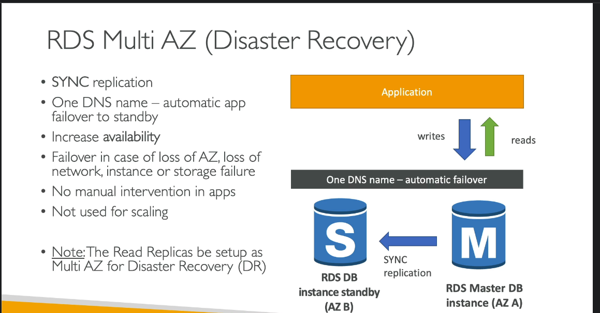

# AWS RDS Disaster Recovery

AWS RDS offers multiple disaster recovery options to ensure data availability and durability in the event of unexpected failures or disasters. This guide covers the key disaster recovery options available in RDS and provides best practices to help you protect your data and maintain business continuity.

---

## 1. Overview

Disaster Recovery (DR) for RDS ensures that databases can recover quickly and remain resilient to failures. DR solutions for RDS involve **multi-AZ deployments**, **cross-region read replicas**, **automated backups**, and **manual snapshots**.

---

## 2. Key Disaster Recovery Options

### 2.1 Multi-AZ Deployment
- **Purpose**: Provides high availability within a single region and protects against failures within an Availability Zone (AZ).
- **How It Works**: 
  - Multi-AZ deployments maintain a **synchronous standby copy** of your database in a different AZ within the same region.
  - In the event of a failure (e.g., infrastructure failure or AZ outage), RDS automatically promotes the standby instance to primary, ensuring minimal downtime.
- **Best Use Case**: Ideal for critical applications needing high availability and quick recovery within the same region.

### 2.2 Cross-Region Read Replicas
- **Purpose**: Enables disaster recovery across regions by creating asynchronous copies of the database in different regions.
- **How It Works**:
  - Cross-region read replicas maintain an **asynchronous replica** in a different AWS region.
  - In a disaster affecting the primary region, you can promote a read replica in another region to act as the new primary.
- **Best Use Case**: Suitable for applications that require geographic resilience and quick recovery in the event of regional outages. Also useful for read scaling in geographically distributed applications.

### 2.3 Automated Backups
- **Purpose**: Provides daily, automatic backups of your RDS instance to ensure data recovery from recent restore points.
- **How It Works**:
  - Automated backups create **daily backups** and **transaction logs** that allow you to restore the database to any point within the retention period (up to 35 days).
- **Limitations**: Automated backups are stored in the same region as the primary RDS instance and may not provide cross-region recovery by themselves.
- **Best Use Case**: Ensures you can recover data from recent snapshots within the same region. Recommended for daily data protection and short-term data recovery needs.

### 2.4 Manual Snapshots
- **Purpose**: Allows for on-demand backups that can be retained indefinitely and used for long-term data protection.
- **How It Works**:
  - Manual snapshots are **user-initiated backups** that persist until you delete them. They can be copied to other regions for cross-region disaster recovery.
- **Best Use Case**: Ideal for preserving data before significant changes, retaining backups beyond automated backup periods, and achieving cross-region recovery by copying snapshots.

---

## 3. Summary Table

| DR Option                  | Purpose                               | Recovery Time | Data Durability | Use Case                                 |
|----------------------------|---------------------------------------|---------------|-----------------|------------------------------------------|
| **Multi-AZ Deployment**    | High availability within the region   | Minutes       | High            | Critical applications needing minimal downtime within a region |
| **Cross-Region Read Replicas** | Cross-region disaster recovery       | Manual promotion | High            | Geographic resilience, read scaling across regions |
| **Automated Backups**      | Daily backups for data recovery       | Hours         | Medium          | Daily recovery within the same region    |
| **Manual Snapshots**       | Long-term, cross-region backups       | Hours         | High (if copied across regions) | Long-term retention, cross-region recovery |

---

## 4. Best Practices for RDS Disaster Recovery

1. **Combine DR Options for Full Protection**:
   - Use **Multi-AZ deployments** for high availability and **cross-region read replicas** for geographic disaster recovery.
   - Enable **automated backups** and periodically take **manual snapshots** for comprehensive data protection.

2. **Copy Snapshots Across Regions**:
   - Regularly copy important manual snapshots to another region to ensure cross-region recovery capabilities in case of regional failure.

3. **Monitor and Test Disaster Recovery Plans**:
   - Regularly test your DR strategy by simulating failovers and ensuring you can successfully promote read replicas or restore from snapshots.

4. **Optimize Backup Retention Periods**:
   - Set an appropriate retention period for automated backups based on recovery needs, and use manual snapshots for longer retention.

5. **Automate Snapshot Management**:
   - Use tools like **AWS Backup** or **Lambda functions** to automate snapshot copies and deletions based on your retention policy.

---

## 5. Disaster Recovery Scenarios

### Scenario 1: Regional Outage
   - **Solution**: Cross-region read replicas or copied snapshots.
   - **Steps**:
     - Promote a cross-region read replica to primary in the secondary region, or restore a database from a copied snapshot.

### Scenario 2: AZ Failure or Hardware Fault
   - **Solution**: Multi-AZ deployment.
   - **Steps**:
     - RDS automatically fails over to the standby instance in a different AZ with minimal downtime.

### Scenario 3: Data Corruption or Accidental Deletion
   - **Solution**: Automated backups and manual snapshots.
   - **Steps**:
     - Restore the database to a point in time before the corruption occurred using transaction logs and backups.

---

## 6. Conclusion

AWS RDS provides a variety of disaster recovery options to protect databases from unexpected failures. **Multi-AZ** ensures high availability, **cross-region read replicas** provide geographic resilience, and **automated backups** and **manual snapshots** protect data from accidental loss. By using a combination of these features, you can design a robust disaster recovery strategy tailored to your application's availability and durability requirements.

**Choose Multi-AZ** for high availability within a region, **cross-region read replicas** for resilience across regions, and **automated/manual backups** for comprehensive data recovery.

---

## 7. Additional Resources

- [AWS RDS Multi-AZ Deployments](https://aws.amazon.com/rds/features/multi-az/)
- [AWS RDS Cross-Region Read Replicas](https://aws.amazon.com/rds/features/read-replicas/)
- [Automated Backups and Snapshots](https://docs.aws.amazon.com/AmazonRDS/latest/UserGuide/USER_WorkingWithAutomatedBackups.html)
  
---
