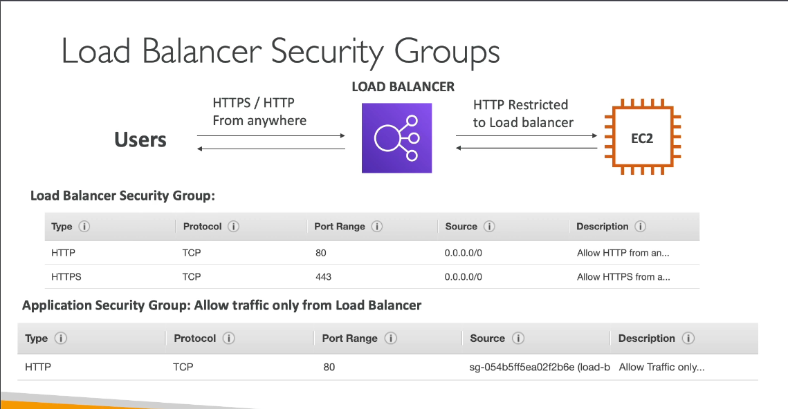

# AWS Elastic Load Balancing (ELB)

**AWS Elastic Load Balancing (ELB)** is a fully managed load balancing service that automatically distributes incoming application traffic across multiple targets, such as EC2 instances, containers, and IP addresses. ELB helps ensure the high availability and reliability of applications by evenly distributing traffic and enabling failover.

---

## Why Use AWS ELB?
- **Improves Application Availability**: ELB spreads traffic across multiple targets, improving the fault tolerance of applications.
- **Scales Automatically**: ELB adjusts capacity to handle incoming traffic, ensuring high performance under varying load conditions.
- **Supports Multiple Load Balancing Types**: Provides application, network, and gateway load balancing to suit different use cases.
- **Increases Fault Tolerance**: ELB can operate across multiple availability zones, making applications resilient to infrastructure failures.
- **Security and Compliance**: ELB integrates with AWS Certificate Manager (ACM) and AWS Identity and Access Management (IAM) for SSL/TLS encryption and provides advanced security options for compliance.

---

## Key Features of AWS ELB
1. **Multiple Load Balancer Types**:
   - **Application Load Balancer (ALB)**: Ideal for HTTP/HTTPS traffic and applications needing advanced routing features (e.g., path-based or host-based routing).
   - **Network Load Balancer (NLB)**: Optimized for high-performance TCP/UDP traffic at the connection level, suitable for real-time applications.
   - **Gateway Load Balancer (GWLB)**: Provides load balancing for third-party virtual appliances and allows integration with security appliances.
  
2. **Automatic Scaling**
   - ELB automatically scales its capacity to meet the demands of incoming traffic.

3. **Health Checks**
   - Regularly checks the health of registered targets and routes traffic only to healthy instances.

4. **Multi-AZ Support**
   - Operates across multiple availability zones, providing high availability and resilience.

5. **Sticky Sessions**
   - Supports session persistence (stickiness), which can help keep a user session on the same backend instance for the session’s duration.

6. **SSL/TLS Termination**
   - Provides SSL termination at the load balancer level, offloading encryption/decryption work from backend instances.

7. **Content-Based Routing**
   - Allows for host- and path-based routing, especially with ALB, enabling fine-grained control over traffic flow.

8. **WebSocket Support**
   - Supports WebSocket connections, allowing for full-duplex communication in real-time applications.

---

## Use Cases for AWS ELB

1. **Web Applications and Microservices**
   - **Description**: Route traffic across multiple EC2 instances or containers in a microservices architecture.
   - **Solution**: Use ALB for HTTP/HTTPS traffic with host/path-based routing to route requests to the appropriate microservice.

2. **High-Performance TCP/UDP Applications**
   - **Description**: Applications needing high-throughput and low-latency, such as gaming or streaming services.
   - **Solution**: Use NLB for stable IP addresses, high-performance TCP/UDP traffic handling, and low-latency requirements.

3. **Distributed Security Appliances**
   - **Description**: Scalable, distributed deployment of third-party security appliances.
   - **Solution**: Use GWLB to load balance traffic across security appliances for tasks like firewalling, intrusion detection, and inspection.

4. **E-Commerce and Session-Based Applications**
   - **Description**: Handle session persistence for applications like e-commerce sites where user sessions must stay on a single backend server.
   - **Solution**: Enable sticky sessions to direct user requests to the same backend instance, ensuring session consistency.

5. **Application Health Monitoring**
   - **Description**: Automatically redirect traffic away from unhealthy instances to avoid service disruption.
   - **Solution**: Set up health checks within ELB to detect unhealthy instances and only route traffic to healthy targets.

6. **SSL Termination**
   - **Description**: Offload SSL/TLS termination to reduce backend workload.
   - **Solution**: ELB handles SSL certificates and encryption, freeing backend servers from encryption overhead.

7. **Real-Time Applications with WebSockets**
   - **Description**: Applications needing full-duplex communication, such as chat applications or financial trading platforms.
   - **Solution**: ELB supports WebSocket connections, making it suitable for real-time, bidirectional data applications.

---

## Summary

AWS Elastic Load Balancing (ELB) enables high availability, scalability, and fault tolerance by distributing traffic across multiple targets in one or more availability zones. With support for various load balancer types (Application, Network, and Gateway), ELB is adaptable to a wide range of application needs. It also offers robust security features, automatic scaling, and built-in health checks, making it a reliable choice for maintaining application uptime and performance.

